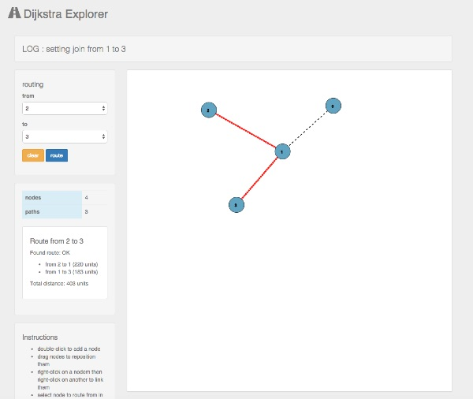

## Installation

- Download all files into a directory
- Open index.html in a modern browser

## Instructions

- double-click to add nodes
- drag and drop a nodes to reposition them
- right click on one node and then on another node to connect them
- repeat until the graph is drawn
- Select source node id
- Select target node id
- Click 'route' button
- Click 'clear' to begin again

